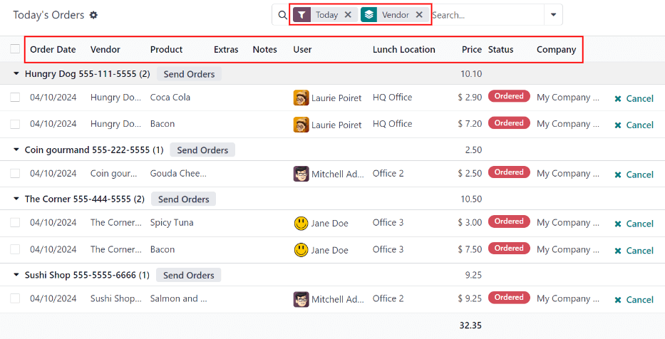
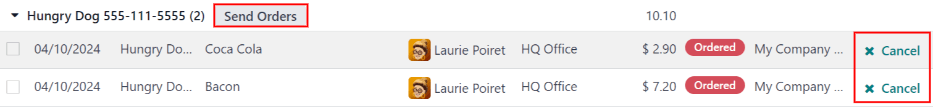

==============
Managing Lunch
==============

In Odoo's *Lunch* application, it is required to have someone manage the orders, vendors, and
products. In addition, someone must be responsible for the orders, and notifying employees when
their orders have arrived. This can be the same person.

In order to manage the *Lunch* application, the user must have :guilabel:`Administrator` rights set
for the :guilabel:`Lunch` application. This is verified by navigating to :menuselection:`Settings
app --> → Manage Users`. Then click on a user to view the various settings. For more information on
access rights, refer to the :doc:`Access rights </applications/general/users/access_rights/>`
documentation.

.. note::
   Only users with administration rights are able to view anything other than :guilabel:`My Lunch`
   in the *Lunch* app.

Today's Orders
==============

To view and manage the orders for the day, navigate to :menuselection:`Lunch app --> Manager:
Today's Orders`. All orders for the day are presented in a list view on the :guilabel:`Today's
Orders` dashboard, with a filter for :guilabel:`Today`, and grouped by :guilabel:`Vendor`, by
default.

The :guilabel:`Order Date`, :guilabel:`Vendor`, :guilabel:`Product`, :guilabel:`Extras`,
:guilabel:`Notes`, :guilabel:`User`, :guilabel:`Lunch Location`, :guilabel:`Price`,
:guilabel:`Status`, and :guilabel:`Company` information appear in the list.

         names highlighted.

Send Orders
-----------

The first step in managing the *Lunch* app is to send the orders to the vendors.

On the :guilabel:`Today's Orders` dashboard, a :guilabel:`✖️ Cancel` icon appears at the end of each
product line that has a red :guilabel:`Status` tag of :guilabel:`Ordered`. If an item needs to be
canceled, click the :guilabel:`✖️ Cancel` icon to cancel the order for that single product.

When orders are ready to be sent, click the :guilabel:`Send Orders` button that appears next to each
vendor's name and phone number.

Once sent, the :guilabel:`Send Orders` button changes to a :guilabel:`Confirm Orders` button, and
the red :guilabel:`Ordered` tags change to blue :guilabel:`Sent` tags, indicating the order has been
sent to the vendor. Users who have placed orders in the *Lunch* app rely on the :guilabel:`Status`
tags to track their orders.

Confirm Orders
--------------

After orders have been sent to the vendor, the next step is to confirm the orders after they have
been delivered.

On the :guilabel:`Today's Orders` dashboard, click the :guilabel:`Confirm Orders` button that
appears next to the vendor's name and phone number. Once confirmed, the :guilabel:`Confirm Orders`
button disappears, and the blue :guilabel:`Sent` tags change to green :guilabel:`Received` tags,
indicating the vendor has delivered the orders. In addition, the :guilabel:`✖️ Cancel` icon at the
end of each product line changes to a :guilabel:`✉️ Send Notification` icon.

If needed, instead of confirming all of the individual products from a vendor, individual products
can be marked as confirmed. To confirm an individual product, click the :guilabel:`✔️ Confirm` icon
at the end of the individual product line. When confirming individual products with this method, the
:guilabel:`Confirm Orders` button remains on the vendor line.

.. image:: management/confirm.png
   :align: center
   :alt: The Today's Orders dashboard, with the two different ways to confirm an order highlighted.

.. example::
   A vendor receives an order for three pizzas and an order of garlic knots. When the delivery
   is made to the company, the *Lunch* manager notices the garlic knots are missing.

   The manager first marks the three pizzas as received by individually confirming the products with
   the :guilabel:`✔️ Confirm` icon at the end of each product line.

   Later, when the vendor delivers the garlic knots, the manager can either click the :guilabel:`✔️
   Confirm` icon at the end of the line for the garlic knots, or they can click the
   :guilabel:`Confirm Orders` button that appears next to the vendor's name and phone number.

Notify employees
----------------

After products are received and the orders are confirmed, the employees must be informed that their
orders have been delivered and are ready to be picked up.

Unlike sending and confirming orders, notifications must be sent individually and cannot be sent in
a batch.

To notify the user their product has arrived, click the :guilabel:`✉️ Send Notification` icon at the
end of each product line. An email is sent to the user informing them their products have been
delivered.

.. important::
   It is important for each individual company to configure their day-to-day work flow to include the
   necessary steps for the *Lunch* app. That includes designating people to be responsible for
   sending and confirming orders, informing employees when orders have arrived, and determining
   where orders are stored while waiting to be picked up by employees. These are parts of the
   *Lunch* app flow that are not configured within Odoo, and are determined by each individual
   company.

Control Vendors
===============

Control Accounts
================

Cash Moves
==========