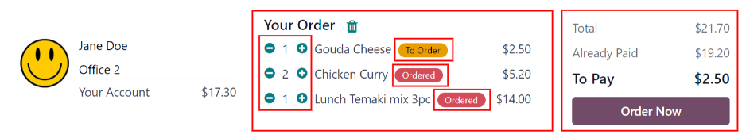

:show-content:

======
Orders
======

When the *Lunch* application is opened, the :guilabel:`Order Your Lunch` dashboard loads. This view
is also accessed by navigating to :menuselection:`Lunch app --> My Lunch: New Order`.

The :guilabel:`Order Your Lunch` dashboard provides a summary of lunch offerings, the user's account
information, the current day's orders, and their statuses.

Order Your Lunch
================

On the main :guilabel:`Order Your Lunch` dashboard, all the necessary information needed to place an
order is visible. The default filter for the products is :guilabel:`Available Today`. This filter
shows only products that can be purchased that day, based on the :ref:`vendor's availability
<lunch/availability>`.

The left-side of the dashboard displays the various :guilabel:`Categories` of products available,
along with the :guilabel:`Vendors` supplying the products. On the far-right side of each line is a
number, which indicates how many products are associated with that respective category or vendor.

To filter the products by categories or vendors, click the checkbox next to the specific category or
vendor to view only those items.

.. note::
   If multiple selections are made, **only** products that fall under **all** the selected options
   are shown.

The top portion of the dashboard, the :guilabel:`Your Order` summary, displays the user's account
information, and the order details for today, if any orders have been placed.

The main section, beneath the user's information, houses all the products in a Kanban view. Each
product card displays the name, cost, vendor, photo, and description of the product. If the product
is configured as new, it also displays a :guilabel:`New` tag.

.. note::
   Anywhere the vendor is listed in the *Lunch* app, such as the Kanban product cards, both the name
   of the vendor appears as well as their phone number.

The products can be displayed in a list view by clicking the :guilabel:`≣ (four parallel lines)`
icon in the top-right.

Placing orders
==============

To place a lunch order, navigate to the main :guilabel:`Order Your Lunch` dashboard by opening the
*Lunch* app. This is also accessed by navigating to :menuselection:`Lunch app --> My Lunch: New
Order`.

Add products to an order
------------------------

Click on a product to order, and the product appears in a :guilabel:`Configure Your Order` pop-up
window.

At the top of the pop-up window is the product image, name, and price. Beneath that are any
available :ref:`extra items or options <lunch/extras>`. Click the checkbox next to any extras to add
them to the order.

Each extra is organized by a category, and lists the name and price for each extra. As extras are
selected, the displayed price at the top of the pop-up window updates to reflect all current
selections.

Beneath the extras is the :guilabel:`Description` of the product, followed by a :guilabel:`Notes`
field. The :guilabel:`Notes` field is used to enter any information to be sent to the vendor
regarding the order, such as any special requests or food allergies.

When all selections for the product have been made, click the :guilabel:`Add To Cart` button in the
lower-left of the pop-up window. To cancel the order, click the :guilabel:`Discard` button.

Errors
~~~~~~

Depending on how the various :ref:`extras <lunch/configure-extras>` are configured for a vendor, it
is possible to receive an error when attempting to add products to the cart.

An error can occur when a product is configured to require a selection be made for an extra, but no
selection is made for that extra category.

When this occurs, a :guilabel:`Validation Error` pop-up window appears. The error is briefly
explained in the pop-up window. Click :guilabel:`Close` to close the window, and make any necessary
changes to the :guilabel:`Configure Your Order` pop-up window.

.. example::
   The vendor, The Pizza Palace, provides a free beverage with any purchase. Their products are
   configured so that a beverage selection is required when adding one of their products to the
   cart.

   If a selection is **not** made, an error occurs. The message that appears is `You have to order
   one and only one Free Beverage with Purchase`.

   .. image:: orders/error.png
      :align: center
      :alt: The :guilabel:`Validation Error` pop-up window with the specific error for the free
            beverage displayed.

Your Order summary
------------------

At the top of the dashboard in the :guilabel:`Your Order` summary, the account information appears
as well as all the information relating to all orders placed during the current calendar day.

As products are added to an order, they appear at the top center of the summary box. Each product is
listed beneath the words :guilabel:`Your Order`, with the product name, quantity, and a status tag.

The available tags that can be displayed for each item are:

- :guilabel:`To Order`: the product has been added to the cart, but has not been purchased yet by
  the user.
- :guilabel:`Ordered`: the product has been purchased by the user and is waiting to be sent to the
  vendor by a *Lunch* app manager.
- :guilabel:`Sent`: the order for the product has been sent to the vendor by a *Lunch* app manager.
- :guilabel:`Received`: the product has been delivered by the vendor to the user's location, and has
  been verified as received by a *Lunch* app manager.

Product quantities can be adjusted by clicking the :guilabel:`➕ (plus sign)` or :guilabel:`➖ (minus
sign)` to the left of the listed product. The product price adjusts in real-time to display the cost
for the currently selected quantity of the product.

The right side of the :guilabel:`Your Order` summary displays the various purchasing information.
The :guilabel:`Total` amount for the entire day's lunch order is displayed. The :guilabel:`Already
Paid` field indicates how much has been paid that day towards the :guilabel:`Total` amount. The
:guilabel:`To Pay` field displays how much is required to pay to place the currently configured
order.

.. tip::
   Users can place multiple orders throughout the day, and are not restricted to placing only one
   lunch order each day. Multiple orders can be placed due to forgetting to add items to an order,
   or if there are multiple meals that are available to be purchased for the office, not just lunch.

   Depending on the various vendors and how the vendors and products are configured, it is possible
   to order breakfast, lunch, dinner, coffee, or snacks.

Submit an order
---------------

To place the order, click the :guilabel:`Order Now` button on the right-side of the :guilabel:`Your
Order` summary. The user is charged the amount that is displayed in the :guilabel:`To Pay` field,
and the cost is deducted from their *Lunch* account balance.

Once the order is placed, the tags for the items just purchased in the :guilabel:`Your Order` field
change from orange :guilabel:`To Order` tags to red :guilabel:`Ordered` tags.

Track an order
--------------

When orders have been sent to the vendors, the tags for the items in the :guilabel:`Your Order`
summary change from red :guilabel:`Ordered` tags to blue :guilabel:`Sent` tags.

Once orders have been received and verified, the tags change from blue :guilabel:`Sent` tags to
green :guilabel:`Received` tags.

Receive an order
----------------

When orders are received at the delivery location, they are confirmed by a *Lunch* app manager, and
a notification is sent to the employee who ordered the food.

My Orders
=========

To view a full list of all orders placed in the *Lunch* app for the currently signed-in user,
navigate to :menuselection:`Lunch app --> My Lunch: My Order History`. This navigates to the
:guilabel:`My Orders` dashboard. The data is filtered by :guilabel:`My Orders` and grouped by
:guilabel:`Order Date: Day`, by default.

All products appear in a list view, organized by date. The list displays the :guilabel:`Order Date`,
:guilabel:`Vendor`, :guilabel:`Product`, :guilabel:`Extras`, :guilabel:`Notes`, :guilabel:`User`,
:guilabel:`Lunch Location`, :guilabel:`Price`, and :guilabel:`Status` information. If in a
multi-company database, a :guilabel:`Company` column also appears.

The total cost for each order is displayed on the line containing the order date. At the bottom of
the list, the total amount paid for all the orders appears.

At the end of each product with a status of :guilabel:`Ordered` or :guilabel:`Sent`, a :guilabel:`X
Cancel` button appears. Click :guilabel:`X Cancel` to cancel that product order. Once a product
order has been canceled, the money paid for that product is refunded and appears in the user's
account.

At the end of each item with a status of :guilabel:`Received`, a :guilabel:`Re-order` button
appears. Click :guilabel:`Re-order` to instantly reorder the product. The new order appears in the
list, under the current date, and the product is paid for, and the money is deducted from the user's
account.

My Account
==========

To view a summary of all transactions in the user's account, navigate to :menuselection:`Lunch app
--> My Lunch: My Account History`. This navigates to the :guilabel:`My Account` dashboard.

The default presentation displays all entries from newest to oldest. The :guilabel:`Date`,
:guilabel:`Description`, and :guilabel:`Amount` are the only fields displayed in the list.

Entries with a negative :guilabel:`Amount` listed are typically for products purchased in the
*Lunch* app. These appear in a `$-XX.XX` format. Entries with a positive balance are typically
either from adding funds to the user's lunch account, or for canceled orders that were refunded to
the user. These appear in a `$XX.XX` format.

         highlighted.
